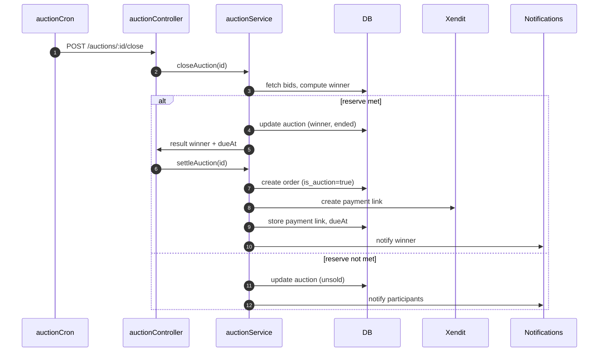

# Museo Marketplace — Blind Auction Implementation Plan

Last updated: 2025-11-15 17:19 (+08:00)

Owner: Marketplace team

Status: Draft — pending rule confirmations

---

## 1) Summary

Implement a first-price sealed-bid (blind) auction system that coexists with the current normal (buy-now) marketplace flow. The system will allow users to submit private bids, select a winner at auction end, generate a normal order for the winning bid amount, and guide the winner to pay within a time window. If unpaid, the system automatically rolls over the offer to the next highest qualified bidder. All calculations use integer centavos to ensure monetary precision.

This design integrates with existing components: listing filters, product detail modal, multi-seller order grouping, Xendit payment links, returns system, payout V2 protections, and sockets/notifications.

---

## 2) Goals & Non‑Goals

- Goals
  - Add blind auctions with sealed bids (first-price) alongside buy-now listings
  - Allow bid placement/update until end time
  - Reserve price support; unsold if reserve not met
  - Winner settlement via existing payments provider (Xendit) and normal orders
  - Automatic rollover to next highest bidder if winner fails to pay
  - Integrate with notifications (socket + email) and Seller Dashboard
  - Preserve existing returns/dispute flows with auction-specific policy

- Non‑Goals (initial phase)
  - Second-price/Vickrey auctions
  - English/dutch/live-outcry auctions
  - Complex anti-sniping extensions (not needed for blind auctions)
  - Mandatory bidder deposits (optional enhancement)

---

## 3) System Architecture

```mermaid
flowchart LR
  subgraph Frontend
    A[Marketplace Grid + Filters]
    B[ProductDetailModal (Auction Mode)]
    C[My Bids Page]
    D[Seller Dashboard > Auctions]
  end

  subgraph Backend
    E[auctionRoutes.js]
    F[auctionController.js]
    G[auctionService.js]
    H[(DB: auctions, auction_bids, auction_deposits)]
    I[auctionCron.js]

    J[orders table]
    K[Xendit Service]
    L[Notifications (Socket/Email)]
  end

  A --> B
  B -->|place bid / my bid / details| E --> F --> G --> H
  I -->|activate/close/settle/rollover| F --> G --> H
  G -->|create order| J
  G -->|create payment link| K
  F --> L
  C --> E
  D --> E
```

Key points:
- Bids are sealed: only the bidder can see their own bid via a dedicated endpoint.
- Cron automates: activation, closing, settlement, and rollover on payment timeout.
- Orders remain first-class citizens; auction orders have `is_auction=true` and `auction_id`.

---

## 4) Business Rules (Defaults)

- Auction type: First-price sealed-bid (blind)
- Reserve price: Optional per auction; if not met, auction ends unsold
- Bidding:
  - Place or update bids until `end_at`
  - Enforce `min_increment_centavos` when updating (vs own last bid)
  - Highest bid wins (tie-breaker: earliest highest bid wins)
- Winner settlement:
  - Payment window: 24 hours (configurable)
  - If unpaid, offer next highest bidder (repeat)
  - When an offer is active for a bidder, they cannot be skipped without timeout or decline
- Deposits: Optional feature (off by default). If enabled: small refundable deposit per auction to reduce spam
- Idempotency: All money mutations and bid placements require `idempotencyKey`
- Precision: All amounts in integer centavos
- Returns: Auctions are generally non-returnable except “not as described/DOA” (enforced by existing returns system)

Open for confirmation: See §16 Decisions.

---

## 5) Data Model & Migrations

Create a migration in `backend/database/migrations/`:

```sql
-- Auction master
CREATE TABLE IF NOT EXISTS auctions (
  auction_id UUID PRIMARY KEY DEFAULT gen_random_uuid(),
  item_id UUID NOT NULL,                     -- references marketplace_items.id
  seller_profile_id UUID NOT NULL,
  listing_title TEXT NOT NULL,
  start_price_centavos INT NOT NULL,
  reserve_price_centavos INT,                -- nullable
  min_increment_centavos INT DEFAULT 0,
  start_at TIMESTAMPTZ NOT NULL,
  end_at TIMESTAMPTZ NOT NULL,
  status TEXT NOT NULL CHECK (status IN ('draft','scheduled','active','ended','settled','cancelled')),
  winner_user_id UUID,
  winning_bid_id UUID,
  payment_due_at TIMESTAMPTZ,
  settlement_order_id UUID,
  created_at TIMESTAMPTZ DEFAULT now(),
  updated_at TIMESTAMPTZ DEFAULT now()
);

-- Sealed bids (store all updates; latest/highest is effective per user)
CREATE TABLE IF NOT EXISTS auction_bids (
  bid_id UUID PRIMARY KEY DEFAULT gen_random_uuid(),
  auction_id UUID NOT NULL REFERENCES auctions(auction_id) ON DELETE CASCADE,
  bidder_user_id UUID NOT NULL,
  amount_centavos INT NOT NULL,
  created_at TIMESTAMPTZ DEFAULT now(),
  is_withdrawn BOOLEAN DEFAULT FALSE
);

CREATE INDEX IF NOT EXISTS idx_auction_bids_auction ON auction_bids(auction_id);
CREATE INDEX IF NOT EXISTS idx_auction_bids_amount ON auction_bids(auction_id, amount_centavos DESC);

-- Optional deposits (phase 2)
CREATE TABLE IF NOT EXISTS auction_deposits (
  deposit_id UUID PRIMARY KEY DEFAULT gen_random_uuid(),
  auction_id UUID NOT NULL REFERENCES auctions(auction_id) ON DELETE CASCADE,
  bidder_user_id UUID NOT NULL,
  amount_centavos INT NOT NULL,
  payment_link_id TEXT,
  status TEXT NOT NULL CHECK (status IN ('pending','paid','refunded','failed')),
  created_at TIMESTAMPTZ DEFAULT now()
);

-- Orders linkage
ALTER TABLE orders
  ADD COLUMN IF NOT EXISTS is_auction BOOLEAN DEFAULT FALSE,
  ADD COLUMN IF NOT EXISTS auction_id UUID;
```

Notes:
- Use integer centavos to avoid float errors (aligns with payout V2).
- Keep foreign keys/joins simple; fetch related data separately where needed.

---

## 6) Backend Modules & Files

- `backend/services/auctionService.js`
  - Business logic: validation, computing current highest per user, winner selection, settlement creation, rollover
- `backend/controllers/auctionController.js`
  - Express handlers, schema validation, error mapping
- `backend/routes/auctionRoutes.js`
  - REST endpoints below
- `backend/cron/auctionCron.js`
  - Scheduled jobs: activate, close, settle, rollover
- Reuse `backend/database/db.js` singleton (no `createClient()` per request)
- Reuse `xenditService.js` for payment link creation and expiration

---

## 7) REST API Endpoints

All responses use `{ success: boolean, ... }`. Auth required unless noted.

- Seller/Admin
  - POST `/api/auctions` — Create an auction (seller-only)
  - PUT `/api/auctions/:auctionId` — Update before start (seller/admin)
  - GET `/api/auctions?seller=me&status=...` — List my auctions (seller)

- Public/Buyer
  - GET `/api/auctions` — Browse auctions (filters: status, item, seller)
  - GET `/api/auctions/:auctionId` — Public details (no bids exposed)
  - GET `/api/auctions/:auctionId/my-bid` — Returns only requester’s latest bid
  - POST `/api/auctions/:auctionId/bids` — Place/update bid
    - Body: `{ amountCentavos, idempotencyKey }`

- Lifecycle (cron/admin)
  - POST `/api/auctions/:auctionId/close` — Close and compute winner (cron)
  - POST `/api/auctions/:auctionId/settle` — Create order + payment link for winner
  - POST `/api/auctions/:auctionId/rollover` — Offer next highest after timeout

### Sample payloads

GET `/api/auctions/:id`
```json
{
  "success": true,
  "auction": {
    "auctionId": "uuid",
    "itemId": "uuid",
    "sellerProfileId": "uuid",
    "listingTitle": "Morning Light",
    "status": "active",
    "startAt": "2025-11-15T09:00:00Z",
    "endAt": "2025-11-16T09:00:00Z",
    "participantsCount": 12,
    "minIncrementCentavos": 10000,
    "reservePriceCentavos": 150000
  }
}
```

GET `/api/auctions/:id/my-bid`
```json
{ "success": true, "amountCentavos": 180000, "updatedAt": "2025-11-15T10:12:00Z" }
```

POST `/api/auctions/:id/bids`
```json
{ "amountCentavos": 200000, "idempotencyKey": "a1b2c3-..." }
```

---

## 8) Auction Lifecycle & Cron Jobs

- Activation
  - At `start_at`, set `status=active`
- Closing
  - At `end_at`, gather highest effective bid per user; determine winner
  - If highest >= reserve (or no reserve), set winner fields and `status=ended`
  - Create settlement offer: `payment_due_at = now() + PAYMENT_WINDOW_HOURS`
- Settlement
  - Create normal order with `is_auction=true`, `auction_id`
  - Create Xendit payment link and send to winner
  - On payment success webhook/manual check, mark order paid; set auction `status=settled`
- Rollover (unpaid)
  - If past `payment_due_at` and order unpaid, expire old link
  - Offer to next highest bidder → create new order/payment link → notify
  - Repeat until paid or exhausted; else `status=cancelled`

---

## 9) Payments & Orders

- Orders
  - `orders.is_auction = true`
  - `orders.auction_id = auctions.auction_id`
  - `orders.seller_profile_id` set from auction
  - If buyer wins multiple auctions at once, optionally group with `payment_group_id`
- Payments
  - Use Xendit payment link creation and expiration (reuse batch-cancel pattern)
  - If unpaid, expire link and rollover
- Accounting
  - Store all amounts in centavos; conversions via helpers
  - Leverage payout V2 safety (idempotency, audit logs)

---

## 10) Frontend Integration

- `frontend/src/pages/Marketplace/ProductDetailModal.jsx`
  - Auction mode: call `/api/auctions/:id`, `/api/auctions/:id/my-bid`, and POST `/bids`
  - Show participants count and time remaining; do NOT reveal others’ bids
  - Disable inputs after end; show result (won/lost) when known

- `frontend/src/pages/Marketplace/Marketplace.jsx`
  - Keep `listingType` filter (all, buy-now, auction)

- `frontend/src/pages/Marketplace/MyBids.jsx` (new)
  - List active, won (awaiting payment/paid), and lost auctions for the user

- `frontend/src/pages/Marketplace/SellerAuctions.jsx` (new)
  - Create/manage auctions; view reserve met?, winner, settlement status

- Sockets: `frontend/lib/socketClient.js`, `hooks/useSocketEvent.js`
  - Events: `auction:update`, `auction:won`, `auction:lost`, `auction:payment:reminder`

---

## 11) Notifications

- Socket events for real-time updates
- Email templates (optional in phase 1):
  - Bid placed confirmation (to bidder)
  - Auction ending soon (to participants)
  - Win/lose result
  - Payment reminder before timeout

---

## 12) Security & Integrity

- Monetary precision: integer centavos only
- Idempotency: required for bid placement; also used in settlement creation
- Rate limiting: per-user per-auction (e.g., 10 bids/min)
- RBAC: sellers can manage their auctions; buyers can only access their own bid info
- Audit logging: create/close/settle/rollover events stored
- Anti-abuse: optional deposits; IP + user-agent logging; suspicious activity flags

---

## 13) Returns & Disputes (Auctions)

- Default: auctions are non-returnable
- Exceptions: “not as described” / DOA handled via existing returns system
- Policy copy: update marketplace terms to clearly state auction return policy

Integration points:
- `backend/routes/returnRoutes.js` remains the hub for return requests

---

## 14) Analytics & Metrics

- Per auction: participants, bid count, reserve met?, hammer price, conversion to paid
- Time to pay, rollover count, failed payments
- Seller performance: auction success rate, average hammer discount/premium

---

## 15) Rollout Plan

- Feature flags
  - `USE_AUCTIONS=true` to enable routes and UI
  - `AUCTION_DEPOSITS_ENABLED=false` initially
- Phased rollout
  1) Migrations and backend APIs behind flag
  2) Internal QA with a few test auctions
  3) Limited beta sellers
  4) Full enablement
- Backout: disable flag; existing auctions continue but new creation disabled

Env examples:
```env
USE_AUCTIONS=true
AUCTION_PAYMENT_WINDOW_HOURS=24
AUCTION_RATE_LIMIT_PER_MIN=10
AUCTION_DEPOSITS_ENABLED=false
```

---

## 16) Decisions Required (proposed defaults)

- First-price vs second-price: First-price (default) — CONFIRM
- Bid updates allowed until end: Yes — CONFIRM
- Payment window: 24h (configurable) — CONFIRM
- Reserve price: Optional per auction — CONFIRM
- Deposits: Off initially; revisit if spam appears — CONFIRM
- Group payments for multiple wins: Allowed via `payment_group_id` — CONFIRM

---

## 17) Testing Strategy

- Unit tests
  - Bid validation, increment, tie-breaker
  - Winner selection and reserve handling
  - Settlement creation + idempotency

- Integration tests
  - Full lifecycle: active → end → settle → paid
  - Rollover on unpaid → next highest → paid
  - Webhook confirmation path and manual payment check

- E2E tests
  - Buyer placing bid, seeing own bid, receiving winner flow
  - Seller creating auction, tracking status

- Edge cases
  - No bids / below reserve → unsold
  - Identical highest bids → earliest wins
  - Payment link expired → rollover works and old link is invalid

- Acceptance criteria
  - Users cannot see others’ bids
  - Winner receives a payable order; payment success marks auction settled
  - Unpaid winner rolls over correctly
  - Money values consistent (centavos)

---

## 18) Implementation Checklist

- Backend
  - [ ] Migrations created and applied
  - [ ] `auctionService.js`, `auctionController.js`, `auctionRoutes.js`
  - [ ] `auctionCron.js` wired to scheduler
  - [ ] Xendit link creation + expiration integrated
  - [ ] Rate limit + idempotency + audit logs

- Frontend
  - [ ] ProductDetailModal auction mode wired to APIs
  - [ ] My Bids page
  - [ ] Seller Auctions page (basic MVP)
  - [ ] Socket events hooked

- Docs & Policies
  - [ ] Terms updated for auctions
  - [ ] Email templates (optional phase 1)

---

## 19) Example Sequence (Close → Settle → Pay)



---

## 20) Appendix — File Map

- Backend
  - `backend/database/migrations/00x_auctions.sql`
  - `backend/services/auctionService.js`
  - `backend/controllers/auctionController.js`
  - `backend/routes/auctionRoutes.js`
  - `backend/cron/auctionCron.js`
- Frontend
  - `frontend/src/pages/Marketplace/ProductDetailModal.jsx` (existing — auction mode wiring)
  - `frontend/src/pages/Marketplace/MyBids.jsx` (new)
  - `frontend/src/pages/Marketplace/SellerAuctions.jsx` (new)

---

## 21) References & Integration Notes

- Payments: reuse cancel-and-recreate payment link pattern for rollovers
- Returns: `backend/routes/returnRoutes.js` remains the entry point for exceptions
- Money: centavos everywhere; leverage payout V2 idempotency and audit logging
- Listing filter: keep `listingType` (all, buy-now, auction)

---

End of document.
