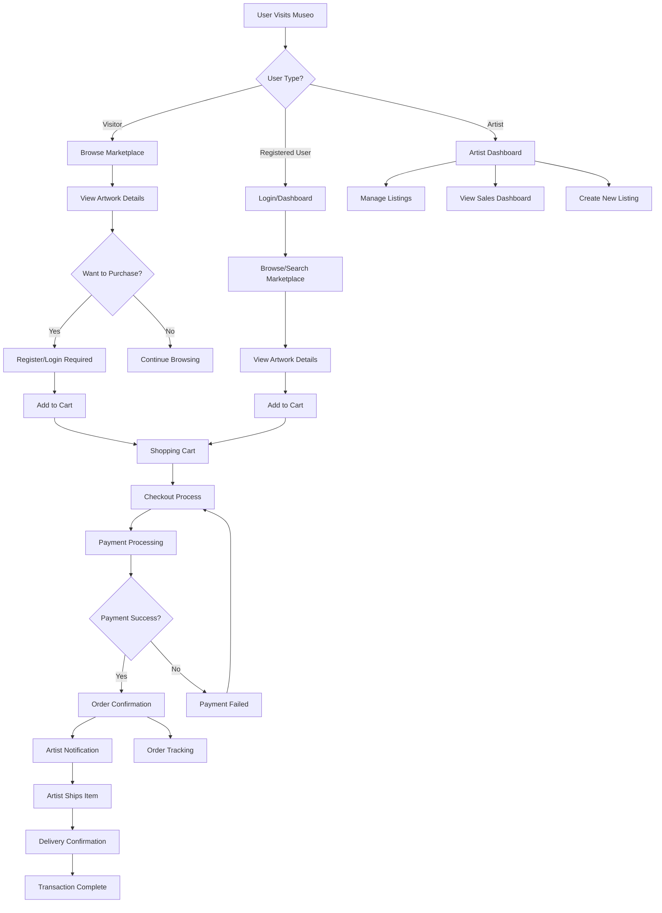
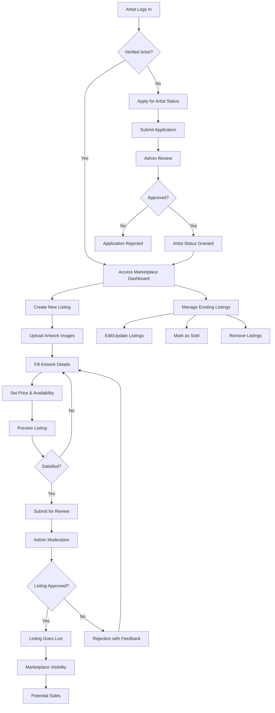
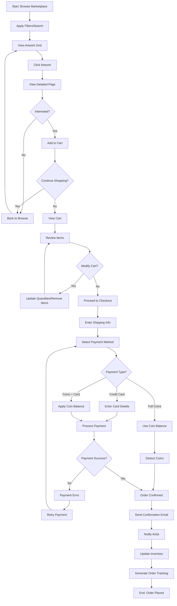
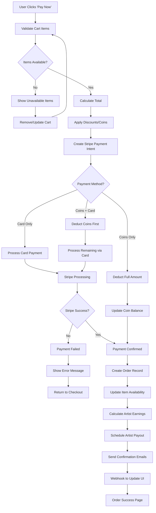
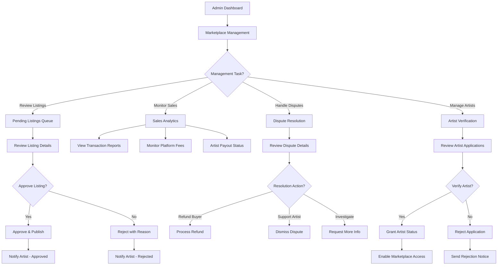
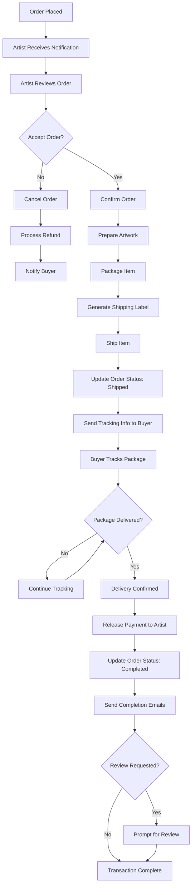
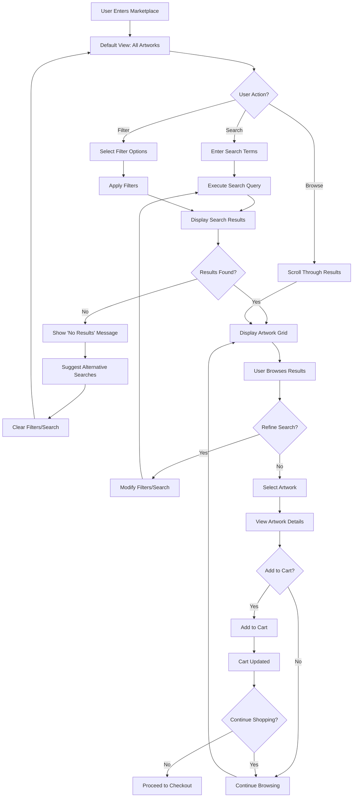
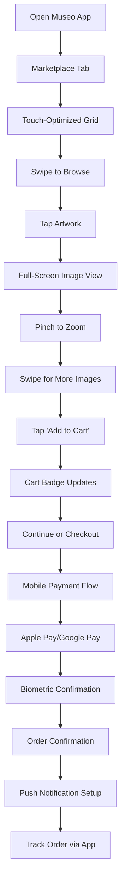

# 🏪 Museo Marketplace - Workflow & Activity Diagrams

## 1. Overall Marketplace User Flow

## 2. Artist Listing Workflow

## 3. Buyer Purchase Activity Diagram

## 4. Payment Processing Workflow

## 5. Admin Marketplace Management

## 6. Order Fulfillment & Tracking

## 7. Search & Discovery Flow

## 8. Mobile App Workflow (Future Enhancement)

---

## Key Workflow Principles

### **User Experience Focus:**
- **Minimal Friction**: Reduce steps to purchase
- **Clear Navigation**: Intuitive marketplace browsing
- **Mobile-First**: Optimized for mobile shopping
- **Trust Signals**: Artist verification, secure payments

### **Business Logic:**
- **Artist Verification**: Only verified artists can sell
- **Quality Control**: Admin approval for listings
- **Fair Pricing**: Transparent fee structure
- **Secure Transactions**: PCI-compliant payment processing

### **Technical Architecture:**
- **Scalable Database**: Efficient queries for large catalogs
- **Real-time Updates**: Inventory and order status sync
- **Payment Security**: Stripe integration with webhooks
- **Performance**: Cached search results and image optimization

These workflows ensure a smooth, secure, and professional marketplace experience for all users while maintaining the museum-quality aesthetic of the Museo platform.
